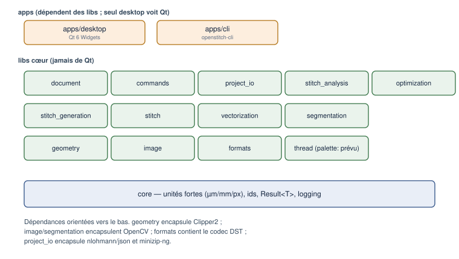
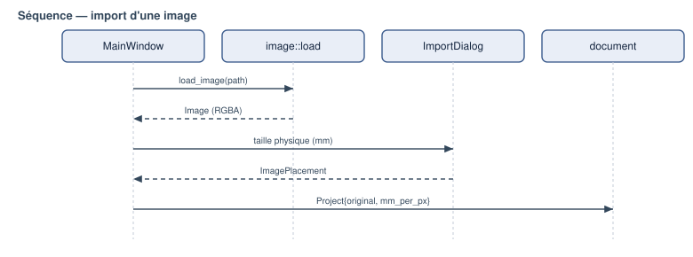

# Architecture logicielle

Public : développeur, mainteneur.

*Figure — Les couches : applications, libs cœur, socle `core`.*

## Principes

1. **Le cœur ne dépend pas de Qt.** Seule `apps/desktop` voit Qt ; tout le reste
   se compile sans interface (vérifié par la CLI et par un build Linux du cœur).
2. **Dépendances orientées vers le bas** : `apps → libs`, et entre libs un graphe
   **acyclique**.
3. **Une lib = une cible CMake** `openstitch::<nom>`, avec ses tests.
4. **Encapsulation des tiers** : Clipper2 dans `geometry`, OpenCV dans
   `image`/`segmentation`/`vectorization`, le codec DST dans `formats`, json et
   minizip dans `project_io`.

## Couches

- **Applications** : `apps/desktop` (Qt), `apps/cli`.
- **Métier / génération** : `document`, `commands`, `project_io`,
  `stitch_generation`, `stitch`, `stitch_analysis`, `optimization`,
  `autodigitize`, `auto_satin`, `formats`.
- **Traitement** : `image`, `segmentation`, `vectorization`, `geometry`.
- **Socle** : `core` (unités, ids, `Result`, logging).

## Séparation cœur / interface

L'application ne contient **aucune logique métier** : elle câble des actions,
affiche, et recalcule l'aperçu. Le chargement d'image, le placement physique, les
transformations, la génération de points, l'analyse, l'ordre et les formats
vivent tous dans les libs. La règle est vérifiable : la CLI utilise les mêmes
modules sans Qt.

## Modèle de document et rendu

Le `document::Project` est la source de vérité (voir *Modèle de données*). Les
**points** ne sont pas stockés : ils sont recalculés par `generate_sequence`,
puis patchés par les **retouches manuelles** de l'objet le cas échéant (Lot
8.1, ADR-014). `stitch_generation::effective_sequence(project)` est le
**point d'entrée unique** que tout consommateur de production (aperçu,
export, analyse, simulation) doit utiliser — il enchaîne les deux passes ;
`generate_sequence` reste appelable séparément (implémentation interne,
tests, générateurs synthétiques). Une garde CTest structurelle
(`tests/check_no_raw_sequence_bypass.cmake`) échoue si un nouveau site de
production appelle `generate_sequence` directement sans annotation explicite.
Le rendu (côté desktop) est organisé en **deux couches** persistantes — base
(image/vecteurs/régions) et points — pour ne reconstruire que le nécessaire,
notamment pendant la simulation.

## Commandes et undo/redo

Toute mutation du document passe par une **commande** (`ICommand`) empilée dans un
`UndoStack`. C'est le patron *Command* : chaque commande sait s'appliquer et se
révoquer exactement.

## Tâches asynchrones

Limitation : il n'y a **pas** d'infrastructure de tâches asynchrones (pool de
threads, annulation, progression) implémentée. Les traitements lourds
(segmentation, remplissage) s'exécutent de façon **synchrone** (avec un curseur
d'attente). Les fonctions de génération sont **pures** sur des instantanés, donc
compatibles avec une exécution en arrière-plan future.

## Diagrammes de séquence

- Import d'une image : voir *Introduction* et la figure du chapitre.
- Génération des points : voir *Génération de points*.
- Export DST : voir *Format DST*.

*Figure — Import d'une image (du menu au document).*

## Implémentation associée

- `CMakeLists.txt` (racine), `libs/*/CMakeLists.txt` — cibles et dépendances.
- `apps/desktop/main_window.cpp` — câblage interface.
- `libs/commands/` — `ICommand`, `UndoStack`.
- `docs/phase0/02-architecture.md` — étude d'architecture d'origine.
