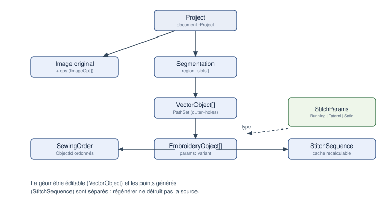

# Modèle de données

Public : développeur.

*Figure — Relations principales du document.*

## Unités et coordonnées

| Type | Fichier | Rôle | Unité |
|---|---|---|---|
| `Micrometers` | `core/units.hpp` | coordonnée interne (int32) | µm |
| `Millimeters` | `core/units.hpp` | affichage / paramètres UI | mm (double) |
| `Pixels` | `core/units.hpp` | domaine image | px (double) |
| `Angle` | `core/units.hpp` | angles | radians |
| `Vec2um` | `core/units.hpp` | point 2D | µm |

Invariant : **aucune coordonnée n'est un `double` nu** ; l'unité interne est le
micromètre entier (déterminisme, pas de dérive), Y vers le haut. La conversion
vers/depuis les pixels exige une résolution explicite (mm/px).

## Identifiants

`ObjectId`, `RegionId`, `ColorId`, `ThreadId` sont des types **forts distincts**
(`Id<Tag>`), générés par un `IdGenerator<T>` monotone (jamais réutilisés).
Fichier : `core/ids.hpp`.

## Document

`document::Project` (fichier `document/project.hpp`) contient :

| Champ | Type | Rôle |
|---|---|---|
| `original` | `image::Image` | image source intacte |
| `mm_per_px` | `Millimeters` | résolution de travail |
| `ops` | `vector<ImageOp>` | pile de prétraitements |
| `segmentation` | `optional<Segmentation>` | carte de régions |
| `vector_objects` | `vector<VectorObject>` | géométrie éditable |
| `embroidery_objects` | `vector<EmbroideryObject>` | objets de broderie (ordre = ordre de couture) |
| `object_ids` | `IdGenerator<ObjectId>` | compteur partagé |

## Types géométriques

- `geometry::PathNode` : `pos` (Vec2um), `type` (Corner/Smooth), `tan_in`/`tan_out`
  optionnelles.
- `geometry::Path` : nœuds + `closed`.
- `geometry::PathSet` : `outer` + `holes`.
- `geometry::Polyline` : polyligne aplatie (travail par longueur d'arc).

## Points et commandes

- `stitch::CommandType` : `Stitch`, `Jump`, `Trim`, `ColorChange`, `Stop`, `End`.
- `stitch::StitchCommand` : `pos` (Vec2um absolue), `type`, `source` (ObjectId).
- `stitch::StitchSequence` : `vector<StitchCommand>`.
- `stitch::StitchStats` : compteurs, longueur de fil, bornes.

## Sérialisation

Voir *Format de projet* : tout ce qui précède se sérialise en JSON (+ PNG +
binaire), sauf les points générés (recalculés).

## Éléments non présents dans le modèle

Limitation : `profil machine`, `cadre` paramétrable riche, `fil`/`palette`,
`avertissement` persistant et `commande undo` sérialisée ne sont pas (ou peu)
présents. Le `Canvas` existe mais reste minimal (taille du cadre).

## Implémentation associée

- `libs/core/include/openstitch/core/{units,ids,error}.hpp`
- `libs/document/include/openstitch/document/{project,vector_object,embroidery_object,canvas}.hpp`
- `libs/geometry/include/openstitch/geometry/{path,polyline}.hpp`
- `libs/stitch/include/openstitch/stitch/sequence.hpp`
