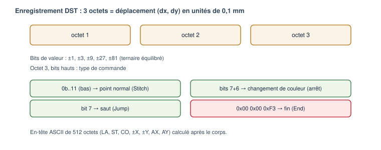

# Format DST (Tajima)

Public : utilisateur avancé, développeur, mainteneur. État : **Implémenté**
(encodeur + décodeur maison, testés en aller-retour).

*Figure — Structure d'un enregistrement DST de 3 octets et des commandes.*

## Rôle du format

Le DST (Tajima) est le format d'échange le plus répandu pour la broderie machine.
C'est un fichier **binaire** contenant un en-tête ASCII puis une suite de
**déplacements relatifs** de l'aiguille. Le module `formats` implémente son
encodage et son décodage **sans dépendance externe** (le format est documenté
publiquement ; la bibliothèque libembroidery n'a servi que de référence croisée).

## Unités

Le pas du DST est **0,1 mm**. En interne, le logiciel travaille en **micromètres**
(1 µm = 1/1000 mm) ; la conversion vers le DST se fait par division par 100, et
la quantification n'intervient **qu'à l'export**.

## En-tête (512 octets ASCII)

Champs terminés par CR, complétés d'espaces jusqu'à 512 octets. Calculés **après**
le corps (donc cohérents avec les octets réellement produits) :

| Champ | Signification |
|---|---|
| `LA:` | nom du motif (16 caractères) |
| `ST:` | nombre d'enregistrements |
| `CO:` | nombre de changements de couleur |
| `+X:` `-X:` `+Y:` `-Y:` | étendue du motif (unités 0,1 mm) |
| `AX:` `AY:` | position finale relative au départ |
| `MX:` `MY:` `PD:` | multi-motif (valeurs par défaut) |

## Corps : enregistrements de 3 octets

Chaque enregistrement encode un déplacement (dx, dy) dans [−121, +121] unités de
0,1 mm, par bits de valeurs ±1, ±3, ±9, ±27, ±81 (ternaire équilibré) répartis
sur les trois octets. Les bits hauts de l'octet 3 donnent le **type** :

| Commande interne | Encodage DST |
|---|---|
| `Stitch` (point) | bits bas `11`, point normal |
| `Jump` (saut) | bit 7 de l'octet 3 |
| `ColorChange` / `Stop` | bits 7 + 6 de l'octet 3 |
| `Trim` (coupe) | convention : N sauts de délta nul (défaut 3) |
| `End` (fin) | `0x00 0x00 0xF3` |

## Encodage (sans dérive)

`encode_dst` quantifie les **positions absolues** au pas de 0,1 mm puis en dérive
les deltas : `delta_i = round(pos_i/100) − round(pos_{i-1}/100)`. Cela borne
l'erreur à ±50 µm **sans dérive cumulative**. Tout déplacement dépassant ±121
est **subdivisé** en sauts intermédiaires. La sortie est **déterministe**.

## Décodage (tolérant)

`decode_dst` lit l'en-tête de façon **laxiste** (la vérité est le corps),
décode chaque enregistrement, réinterprète une rafale de sauts nuls en `Trim`, et
**ne plante jamais** : un fichier tronqué ou sans marqueur de fin renvoie une
erreur claire.

## Exemple interprété (motif minimal)

Un carré de 5 mm : après l'en-tête, une commande `Jump` amène au premier coin,
puis quatre points `Stitch` de 5 mm parcourent les côtés, et l'enregistrement
`0x00 0x00 0xF3` termine. Sur ce motif, `+X:` et `+Y:` valent 50 (5 mm en unités
de 0,1 mm) et `CO:` vaut 0.

## Limites et informations perdues

Avertissement : Un DST **ne conserve pas** les objets éditables de haut niveau
(contours, remplissages, colonnes satin, paramètres). Il ne stocke pas non plus
les **couleurs réelles** (seulement des arrêts). Après un export DST, seul le
**projet `.osp`** permet de retrouver la géométrie et les paramètres.

## Tests

- **Aller-retour** : séquence → encode → decode → séquence' (mêmes types,
  positions à ±50 µm) — dont un test sur **tous les deltas** de −121 à +121.
- **Subdivision** d'un déplacement > 12,1 mm.
- **Fichiers invalides** (vide, tronqué, sans fin) refusés proprement.
- **Déterminisme** octet à octet.

## Implémentation associée

- `libs/formats/include/openstitch/formats/dst.hpp` — API.
- `libs/formats/src/dst.cpp` — `encode_dst`, `decode_dst`, `write_dst_file`,
  `read_dst_file`.
- `apps/cli/main.cpp` — `stats`, `dst2svg`.
- Tests : `tests/unit/formats/test_dst.cpp`.
