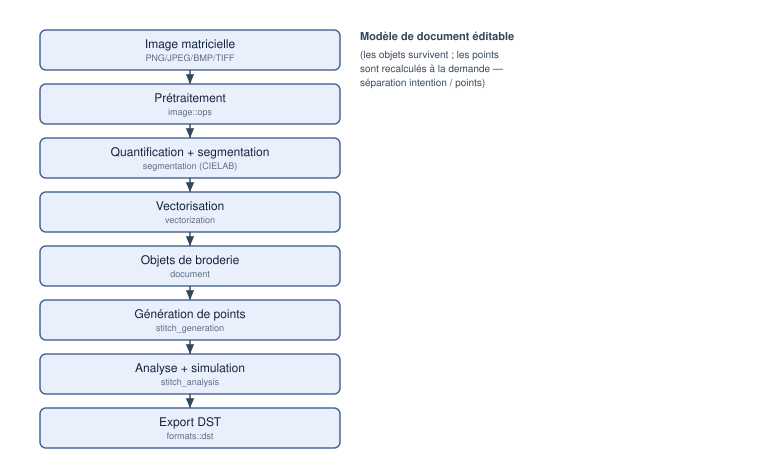

# Introduction et présentation générale

## Vision du projet

OpenStitch Studio vise à offrir, **gratuitement et en logiciel libre**, la chaîne
de travail qui va d'une **image matricielle** jusqu'à un **fichier de broderie
machine** au format DST (Tajima). Le projet est écrit principalement en C++
moderne, fonctionne localement (sans compte, sans cloud, sans télémétrie) et
sépare strictement son cœur métier de son interface graphique.

Le nom « OpenStitch Studio » est temporaire et remplaçable (décision ADR-001) :
il n'apparaît en dur qu'à un seul endroit du code (`kAppName`).

## Cas d'usage

- Transformer un logo ou une illustration simple en motif brodable.
- Segmenter une image en zones de couleur et les convertir en objets de broderie
  éditables (contours, remplissages, colonnes satin).
- Générer, prévisualiser et analyser les points avant de produire un fichier DST.
- Relire un fichier DST existant et l'inspecter.

## La chaîne de travail en un coup d'œil

*Figure 1 — Le pipeline image → broderie et les modules responsables.*

L'idée centrale est la **séparation entre l'intention et le résultat** : la
géométrie éditable (objets vectoriels et de broderie) est conservée dans un
modèle de document ; les **points** sont recalculés à la demande à partir de
cette géométrie. Modifier un paramètre régénère les points sans détruire l'objet
source.

## Quatre représentations distinctes

Il est essentiel de distinguer quatre choses que le logiciel manipule :

| Représentation | Ce que c'est | Type/Module |
|---|---|---|
| **Image** | pixels RGBA | `image::Image` |
| **Région** | zone de couleur connexe issue de la segmentation | `segmentation::Region` |
| **Objet vectoriel** | contours (extérieur + trous), éditables | `document::VectorObject` |
| **Objet de broderie** | intention de couture (type de point + paramètres) | `document::EmbroideryObject` |
| **Séquence de points** | commandes machine (Stitch/Jump/…) | `stitch::StitchSequence` |

Un DST, lui, ne contient **que** la séquence de points : il ne conserve **pas**
les objets éditables (voir le chapitre *Format DST*).

## Formats

- **Entrée image** : PNG, JPEG, BMP, TIFF.
- **Broderie** : DST en import et export.
- **Diagnostic** : SVG en export.
- **Projet** : `.osp` (archive contenant tout le document éditable).

## Limites générales

Le logiciel constitue un **prototype fonctionnel** couvrant l'ensemble du
pipeline principal. Ses composants sont **testés logiciellement**, mais la
**qualité de broderie produite n'a pas encore été validée sur une machine à
broder réelle**. Les heuristiques physiques (compensation de tirage, densité)
sont paramétrables mais approximatives, le satin est **expérimental** et le
tatami **partiel** (voir *Limitations et roadmap*). Certaines conventions DST
varient aussi selon les machines.

Limitation : Certaines fonctionnalités décrites dans l'étude de cadrage
initiale (palette de fils réelle, remplissages courbes, profils machine
avancés, édition manuelle des points) sont **prévues mais non implémentées**.
Elles sont signalées comme telles tout au long du document.

## Philosophie open source

Le projet est sous licence **Apache-2.0** (permissive avec clause de brevets).
Pour conserver cette distribution, aucun code sous licence copyleft incompatible
(par exemple la GPL d'Ink/Stitch) ne doit être intégré directement — cela
imposerait vraisemblablement une redistribution sous licence copyleft. Les idées
algorithmiques restent réimplémentables indépendamment à partir de sources
publiques. Voir *Licences* pour la formulation complète et les précautions.

## Implémentation associée

- `libs/core/include/openstitch/core/app_info.hpp` — nom et version.
- `docs/phase0/` — étude de cadrage et 14 décisions d'architecture (ADR).
- `README.md` — résumé du projet (établi à un jalon antérieur).
