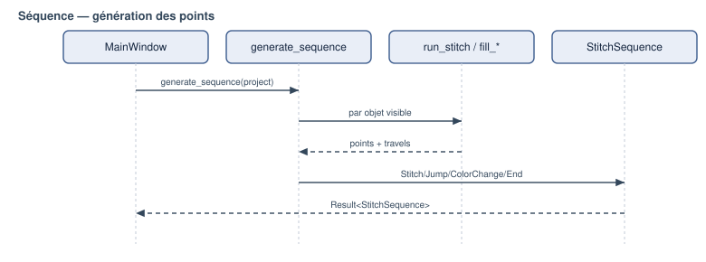

# Génération de points — point droit et fondations

Public : utilisateur avancé, développeur.

> État : Présent dans le code : oui · Tests unitaires : oui · Tests visuels :
> oui (SVG golden) · Import/export DST : oui · Test sur machine réelle : **non**
> · **Statut recommandé : implémenté** — reconstruit sur des fondations de
> longueur d'arc, c'est le générateur le plus solide du projet.

*Figure — Génération de la séquence de points à partir du document.*

## Fondations géométriques

Avant tout type de point, deux primitives (dans `geometry`) :

- **Aplatissement de Bézier adaptatif** (`flatten`) : les segments à tangentes
  sont subdivisés récursivement (De Casteljau) jusqu'à ce que l'écart à la corde
  passe sous une tolérance. On n'échantillonne **jamais** une Bézier par pas
  uniforme du paramètre `t`.
- **Paramétrisation par longueur d'arc** (`cumulative_lengths`, `point_at_length`)
  et **ré-échantillonnage équilibré** (`resample_run`) : un tronçon de longueur
  L est divisé en `n = ceil(L / cible)` parts **égales**, donc chaque point est
  ≤ la longueur cible et il n'y a pas de segment résiduel minuscule.

Sémantique du paramètre : avec `ceil`, le champ (`RunningConfig::target_length`)
est traité comme une **longueur maximale** (les points ne la dépassent jamais,
mais peuvent être plus courts). Si on voulait une longueur *souhaitée* dont
l'espacement colle au plus près de la consigne, `round(L / cible)` serait plus
adapté. Ce choix (`ceil` plutôt que `round`) est **assumé explicitement** dans
le code (`libs/geometry/src/polyline.cpp`, commentaire de `resample_run` :
« Écart assumé (...) ; `ceil` garantit en plus le respect strict de la longueur
maximale. ») — ce n'est plus une ambiguïté ouverte, `target_length` se comporte
délibérément comme un maximum, pas une cible exacte.

## Point droit (running stitch)

`run_stitch(path, config)` :

1. aplatit le chemin (courbes comprises) ;
2. détecte les **coins vifs** (angle de rotation > seuil, ~35° par défaut) ;
3. découpe le chemin en tronçons entre coins ;
4. ré-échantillonne **chaque tronçon par longueur d'arc**.

Résultat : les coins sont des pénétrations **exactes** ; les portions lisses ont
un espacement **régulier**. Un cercle finement facetté ne produit donc plus un
point par facette, mais des points espacés de la longueur cible.

*Figure — Trajectoire réelle produite par le moteur (SVG de diagnostic) : cercle
de rayon 20 mm, longueur cible 3 mm. Trait = couture, orange pointillé = sauts.*

Le résultat est structuré : `RunningResult { points, warnings, stats }`. Il ne
plante jamais et renvoie un avertissement (chemin vide, trop court, point trop
long…).

## Chemins fermés, sens, phase, départ

`RunningConfig` expose : `reverse` (sens), `phase` (décalage curviligne des
boucles lisses) et `start` (point de départ projeté sur une boucle fermée). Une
boucle fermée revient à son point de départ sans doublon minuscule.

## Répétitions

`apply_repeat_mode` implémente des modes **explicites** :

| Mode | Effet |
|---|---|
| `SinglePass` | un passage |
| `BackAndForth` | aller complet puis retour (termine au départ) |
| `BeanStitch` | chaque intervalle cousu `n` fois (impair) — point triple |
| `Backstitch` | progression avec recouvrement |

Les mouvements nuls sont supprimés ; le nombre exact de traversées est testé.

## Traitement des points courts

Le running stitch **ne supprime pas** aveuglément les points sous une longueur
minimale (cela déplacerait un sommet ou détruirait un détail). À la place, les
**vrais coins** (angle de rotation > seuil) sont préservés comme pénétrations
exactes, et chaque tronçon lisse est ré-échantillonné indépendamment par
longueur d'arc — ce qui évite les rafales de micro-points sur les courbes
finement facettées. Un point plus court que `min_length` peut subsister à un
**coin serré** (deux coins proches) ; il est alors **signalé** par un
avertissement, pas supprimé.

Limitation : ce traitement fin s'applique au running stitch. Aux **fins de
rangée** du tatami et surtout aux **extrémités pointues** d'un satin, des
pénétrations peuvent se rapprocher voire s'empiler ; la gestion dédiée (retrait,
redistribution, terminaisons) n'est **pas** implémentée. C'est une des raisons du
statut *expérimental* du satin.

## Outil de diagnostic

`openstitch-cli stitchdebug --shape circle|line|corner|bezier|star|ring
--length 3 --output-svg out.svg` génère les points sur une forme de référence,
affiche les statistiques (points, longueur, segment min/max) et un SVG. Utilisé
pour valider le moteur (voir *Tests*).

## Implémentation associée

- `libs/geometry/src/polyline.cpp` — `flatten`, longueur d'arc, `resample_run`.
- `libs/stitch_generation/src/running_stitch.cpp` — `run_stitch`,
  `apply_repeat_mode`, `apply_repeats`, `sample_path`.
- `apps/cli/main.cpp` — sous-commande `stitchdebug`.
- Docs de conception : `docs/stitch-engine-audit.md`,
  `docs/stitch-engine-research.md`.
- Tests : `tests/unit/geometry/test_polyline.cpp`,
  `tests/unit/stitch/test_running_stitch.cpp`.
