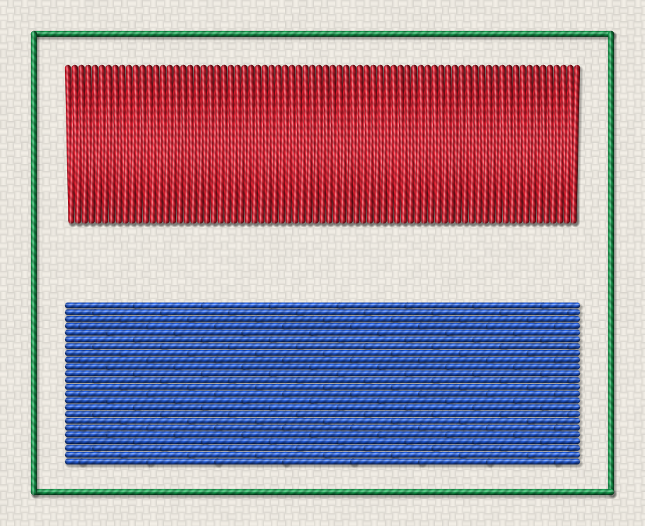

# Guide utilisateur détaillé

Public : utilisateur débutant et avancé. Ce chapitre documente chaque menu,
outil et raccourci **réellement présents** dans `apps/desktop/`. Pour un premier
motif pas à pas, voir le [Guide de prise en main](getting-started.md) ; pour un
problème, [Dépannage](troubleshooting.md) ; pour les mots techniques,
[Glossaire](glossary.md).

## Disposition générale

L'interface place le **canevas au centre** et l'entoure de zones fonctionnelles :

```
Menus
Barre d'outils principale
Barre contextuelle (suit la sélection)
[Palette d'outils] [ CANEVAS ] [ Inspecteur ]
[Document / Ordre] [ Workflow ]
Barre de simulation (zone réservée)
Barre d'état
```

Tous les panneaux sont des **docks** redimensionnables, déplaçables et masquables
(**Ctrl+Shift+P** = mode canevas). Leur disposition, la géométrie de la fenêtre,
le **thème** et la **densité** sont mémorisés d'une session à l'autre (préférences
d'interface, distinctes du projet `.osp`).

## État d'accueil

Tant qu'aucun document n'est ouvert, le centre du canevas propose **Ouvrir une
image**, **Ouvrir un projet** et **Importer un DST**, avec une courte explication
et les cinq derniers projets (le menu Fichier ▸ Récents en garde dix).

## Ouvrir un fichier depuis l'Explorateur ou par glisser-déposer

Un fichier peut être ouvert sans passer par les menus : double-clic sur un `.osp`
(ou « Ouvrir avec » OpenStitch Studio), nom de fichier passé en argument de la
ligne de commande, ou glisser-déposer sur la fenêtre. L'application route par
extension : `.osp` (projet), `.dst` (import machine), `.svg` et images PNG/JPEG/BMP/TIFF.
Les mêmes gardes que les menus s'appliquent : si le projet courant a des
modifications non enregistrées, l'application demande d'abord d'enregistrer. Une
extension non prise en charge est signalée en barre d'état, sans rien ouvrir.

## Le canevas

La zone centrale est un canevas dont l'unité est le **millimètre** (origine au
centre, Y vers le haut). Des **règles** graduées en mm bordent le haut et la
gauche ; une **grille** adaptative et le **cadre** de broderie (rectangle rouge,
défini par l'utilisateur, cf. *Taille du cadre*) sont dessinés. La position du
curseur en mm apparaît dans la barre d'état.

Le **mode d'interaction** vient de la palette d'outils (à gauche) :

- **Sélection** (`V`) : sélectionner une région/un objet (Maj ajoute, Ctrl bascule, glisser dans le vide trace un rectangle de sélection) ; la vue se déplace au clic molette ou à Espace + glisser.
- **Déplacer la vue** (`H`) : déplacement pur (le clic ne sélectionne pas).
- **Recadrer l'image** (`M`) : glissez le cadre à conserver ; l'image est recadrée **au
  relâchement** (Échap : annuler). Le message de la barre d'état le rappelle, et une confirmation est
  demandée si des objets existent déjà (ils ne suivraient pas l'image). Pour dessiner un rectangle,
  utilisez l'outil `R`.
- **Outils de dessin** (palette de gauche) : **Rectangle** (`R`), **Ellipse** (`O`,
  Maj = cercle), **Polygone** (`P`), **Polygone régulier** (`G`, nombre de côtés
  dans la palette), **Courbe de Bézier** (`B`), **Main levée** (`L`) et **Colonne
  satin** (`S`, clics alternés côté A / côté B). Entrée ou double-clic termine
  le tracé, Retour arrière retire le dernier point, Échap l'annule.
- **Couteau** (`K`) : trace une ligne qui découpe les formes traversées (voir *Menu Forme*).
- **Zoom** : molette (ancrée sous le curseur) ou barre d'outils / menu Affichage.
- **Échap** : revient à la Sélection et annule le mode fusion en cours.

### Sélection multiple

Avec l'outil Sélection, **Maj + clic** ajoute un objet à la sélection, **Ctrl +
clic** le bascule, et **glisser dans le vide** trace un rectangle (vers la droite :
objets entièrement englobés ; vers la gauche : objets touchés ; Maj/Ctrl
s'appliquent aussi au rectangle). Une sélection de plusieurs **objets vectoriels**
se déplace d'un bloc (glisser), se
duplique (Alt + glisser) et se supprime ensemble (clic droit ▸ « Supprimer N
objets »). Les entrées qui n'ont de sens que pour un seul objet (type de points,
décaler, orientation) disparaissent alors du menu. **Les régions de segmentation**
ont leur propre sélection multiple (voir *Menu Segmentation*) ; la dernière région cliquée est la
« région active ».

La sélection d'un objet est tracée en **double contraste** (halo clair + trait
d'accent), lisible sur tout fond. Le rendu est organisé en deux couches
(image/vecteurs/régions d'une part, points d'autre part) pour rester fluide sur
de gros motifs.

## Souris et clavier

Le comportement de la souris et du clavier dans le canevas suit une **table
unique** (`apps/desktop/interaction_map.cpp`) : c'est elle qui pilote le
comportement du canevas, la ligne d'indications de la barre d'état et le
tableau ci-dessous. Principes : la **molette** zoome sous le curseur (**Ctrl + molette** aussi ;
c'est ainsi que Windows livre le pincement d'un pavé tactile), le **clic
molette** ou **Espace** + glisser déplace la vue, **Maj** ajoute à la sélection,
**Ctrl** ajoute ou retire, un **appui long** ou **Alt + clic** ouvre
« Sélectionner dessous ». La correspondance est exacte : Maj + clic n'est pas un
clic simple, et le panoramique reste disponible pendant un outil de dessin. Sous
Windows, un pavé tactile se distingue mal d'une molette : le préréglage de
navigation « Pavé tactile » (Affichage ▸ Navigation) y met en avant
Espace + glisser et Ctrl + molette.

Le tableau est **généré** par `openstitch_gesture_table --markdown` ; ne pas le
modifier à la main (le test `docs_gestures_in_sync` échoue si la table du code
et ce bloc divergent). Pour le régénérer, recopier la sortie de la commande
entre les deux marqueurs.

<!-- GESTURES:BEGIN -->
| Réf. | Contexte | Geste | Action |
|---|---|---|---|
| G1 | Partout | Molette | Zoom au curseur |
| G2 | Partout | Ctrl + Maj + clic molette + glisser | Zoom continu |
| G3 | Partout | Clic molette + glisser | Panoramique |
| G4 | Partout | Double-clic molette | Cadrer le design |
| G5 | Partout | Espace + glisser | Panoramique (sans clic molette) |
| G6 | Partout | Maj + molette | Défilement horizontal |
| G7 | Partout | Alt + molette | Défilement vertical |
| G8 | Partout | Défilement à deux doigts | Panoramique |
| G9 | Partout | Pincement | Zoom au curseur |
| G10 | Sélection | Clic droit | Menu contextuel |
| G10b | Déplacement | Clic droit | Menu contextuel |
| G10c | Édition de nœuds | Clic droit | Menu contextuel |
| G10d | Édition de points | Clic droit | Menu contextuel |
| G11 | Partout | Suppr | Supprimer la sélection |
| G12 | Partout | Échap | Annuler l'outil en cours |
| G13 | Partout | Ctrl + molette | Zoom au curseur |
| G14 | Partout | F | Ajuster au canevas |
| G15 | Partout | Flèches | Déplacer l'objet de 0,1 mm |
| G15b | Partout | Maj + Flèches | Déplacer l'objet de 1 mm |
| P1 | Déplacer la vue | Glisser | Panoramique |
| S1 | Sélection | Clic | Sélectionner (le vide désélectionne) |
| S2 | Sélection | Maj + clic | Ajouter à la sélection |
| S3 | Sélection | Ctrl + clic | Basculer dans la sélection |
| S3b | Sélection | Ctrl + Maj + clic | Basculer dans la sélection |
| S4 | Sélection | Appui long | Sélectionner dessous |
| S5 | Sélection | Alt + clic | Sélectionner dessous |
| S6 | Sélection | Glisser | Sélection par rectangle (vers la droite : englobe, vers la gauche : croise) |
| S7 | Sélection | Maj + glisser | Rectangle : ajouter à la sélection |
| S8 | Sélection | Ctrl + glisser | Rectangle : basculer dans la sélection |
| S8b | Sélection | Ctrl + Maj + glisser | Rectangle : basculer dans la sélection |
| S10 | Sélection | Double-clic | Entrer en édition de l'objet |
| S11 | Sélection | Survol | Surbrillance de pré-sélection |
| M1 | Déplacement | Glisser | Déplacer l'objet |
| M2 | Déplacement | Maj + glisser | Verrouiller l'axe |
| M4 | Déplacement | Alt + glisser | Dupliquer en déplaçant |
| D1 | Dessin (clics) | Clic | Ajouter un point |
| D2 | Dessin (clics) | Double-clic | Terminer le tracé |
| D2b | Dessin (clics) | Entrée | Terminer le tracé |
| D3 | Dessin (cadre) | Maj | Contraindre la forme (carré, cercle) |
| D4 | Dessin (cadre) | Alt | Dessiner depuis le centre |
| D5 | Dessin (clics) | Ctrl | Suspendre l'accroche |
| D6 | Dessin (clics) | Retour arrière | Retirer le dernier point |
| D7 | Dessin (clics) | Échap | Annuler l'outil en cours |
| N1 | Édition de nœuds | Glisser | Déplacer le nœud |
| N2 | Édition de nœuds | Maj + glisser | Verrouiller l'axe |
| N2b | Édition de nœuds | Ctrl + glisser | Suspendre l'accroche |
| N4 | Édition de nœuds | Suppr | Supprimer les nœuds sélectionnés |
<!-- GESTURES:END -->

Précisions sur les gestes du tableau :

- **Surbrillance** : avec l'outil Sélection, le contour en pointillés de l'objet non
  sélectionné situé sous le curseur est mis en évidence ; elle disparaît quand le
  curseur quitte le canevas ou pendant un glisser.
- **Alt** : *Alt + clic* ouvre « Sélectionner dessous », y compris sur le corps d'un
  objet déjà sélectionné ; *Alt tenu avant l'appui*, puis glisser le corps d'un objet
  **déjà sélectionné**, le **duplique** en déplaçant la copie (un seul pas
  d'annulation) ; la copie ne reprend **aucun objet de broderie** de l'original (il
  faut lui en créer un), de même que la commande « Dupliquer ». En dessin de
  rectangle, ellipse ou polygone régulier, *Alt* dessine le cadre depuis son centre
  (le point d'appui).
- **Maj** pendant un glisser verrouille l'axe dominant (objets et nœuds) ; il ne
  suspend **pas** l'accroche. **Ctrl** suspend l'accroche pendant le tracé d'un polygone
  ou d'une colonne satin et pendant le glisser d'un nœud.
- **Glisser un nœud** : le nœud ne bouge qu'après le seuil de glisser (un clic légèrement
  tremblé ne crée ni déplacement ni pas d'annulation) ; la barre d'état affiche ses
  coordonnées en mm et un cercle marque le sommet visé quand l'accroche est active ;
  **Échap** annule le glisser sans rien modifier.
- **Redimensionner** : les quatre poignées carrées (zone de 22 px, curseur diagonal propre
  à chaque coin) redimensionnent autour du coin opposé ; **Maj** conserve les proportions,
  un cadre en pointillés et « Taille : L × H mm » (barre d'état) montrent le résultat,
  **Échap** annule. La forme ne peut ni être retournée par inadvertance (miroir) ni
  tomber sous 5 % de sa taille.
- **Accrochage des nœuds au glisser** (Affichage ▸ *Accrochage des nœuds au
  glisser*, réglage `edit/snapNodesOnDrag`, **désactivé par défaut**) : un nœud
  relâché à moins de 1 mm (et 10 px) d'un sommet d'un autre objet s'y accroche ;
  Ctrl pendant le glisser l'évite. La bascule **Accroche** de la barre d'état reflète
  et pilote ce réglage. Glisser un objet entier n'a pas d'accroche.


## Menu Fichier

| Action | Raccourci | Effet |
|---|---|---|
| Nouveau projet | Ctrl+N | Repart d'un document vierge (voir ci-dessous) |
| Ouvrir une image… | Ctrl+O | Charge PNG/JPEG/BMP/TIFF ou SVG puis demande la taille physique ; propose d'enregistrer le projet en cours |
| Enregistrer le projet | Ctrl+S | Réécrit le `.osp` courant (demande où enregistrer la première fois) |
| Enregistrer le projet sous… | Ctrl+Maj+S | Écrit le document dans un nouveau `.osp`, qui devient le fichier courant |
| Ouvrir un projet… | — | Recharge un `.osp` |
| Récents | — | Sous-menu des 10 derniers projets ouverts ou enregistrés (voir ci-dessous) |
| Vider la liste des récents | — | Efface la liste |
| Exporter en DST… | Ctrl+E | Montre d'abord le résumé (dimensions, points, résultat de l'analyse), puis demande le fichier `.dst` (points uniquement) |
| Fiche de production… | — | Aperçu, impression ou export PDF A4 d'une fiche (dimensions, points, temps estimé, blocs de couleur, avertissements, notes) ; voir [fiche de production](production-sheet.md) |
| Importer un DST… | — | Relit un `.dst` comme séquence de points (propose d'enregistrer le projet en cours) |
| Importer un DXF… / Exporter en DXF… | — | Échange de contours vectoriels avec un logiciel de dessin (les points ne sont pas concernés) |
| Quitter | Ctrl+Q | Ferme l'application |

**Nouveau projet** : si le document courant a été modifié, une garde propose
d'enregistrer, d'abandonner les modifications ou d'annuler — la même que celle
de la fermeture de la fenêtre. Le document repart à vide (aucune image, aucun
objet, aucune région), la pile Annuler/Rétablir est vidée, et **tout l'état
d'édition de la fenêtre est relâché** : sélections, mode d'édition des points,
modes satin (barreaux et rails), guides de direction, tracé en cours
(polygone, main levée, colonne satin, Bézier) et simulation. L'outil revient à
Sélection. Cette réinitialisation est partagée par tous les chemins qui
remplacent le document (ouvrir une image, un SVG, un projet, importer un DST).

**Import** : le dialogue affiche un aperçu, les dimensions en pixels, la
résolution (**mm/pixel et dpi**) en direct, la taille du cadre, et **alerte si l'image
dépasse le cadre**. La taille proposée d'emblée **tient dans le cadre** (96 dpi, ramenée au cadre
si besoin) et **Ajuster au cadre** y revient en un clic. Avec « Conserver les proportions », les
bornes des champs empêchent de dépasser la plage 1–1000 mm sans respecter le ratio ; décochée,
une alerte indique de combien l'image est étirée. Le dossier du dernier import est mémorisé. **Export DST** : un **résumé** (dimensions, points, sauts,
coupes, changements de couleur, fil estimé, cadre, dépassement éventuel) est
présenté avant écriture, avec un rappel que le DST ne conserve pas les objets.

**Enregistrer** : le document retient le fichier `.osp` auquel il est rattaché
(celui qu'on vient d'ouvrir ou d'enregistrer). Ctrl+S réécrit ce fichier
directement ; le sélecteur n'apparaît que pour un document encore sans fichier,
ou via **Enregistrer sous…** (Ctrl+Maj+S), qui adopte ensuite le nouveau
fichier. Tout changement de document (Nouveau, ouvrir une image/un SVG/un
projet, importer un DST) oublie ce rattachement, pour qu'un Ctrl+S ne puisse
jamais écraser le projet précédent. L'écriture est **atomique** (fichier
temporaire puis renommage) : une coupure en cours d'enregistrement ne détruit
pas le `.osp` existant.

Le titre de la fenêtre affiche le nom du fichier courant (ou « Sans titre ») et
un indicateur **modifié** (`*`) ; quitter avec des modifications non
enregistrées propose **Enregistrer / Ignorer / Annuler**.

### Projets récents

**Fichier ▸ Récents** liste les derniers projets ouverts ou enregistrés (10 au plus, le
plus récent en tête) et l'écran d'accueil les reprend. Un fichier qui n'existe plus est retiré
de la liste à l'ouverture suivante. La liste est une préférence de l'application,
pas du projet : elle est stockée avec les autres préférences (voir
[Installation](installation.md), « Où l'application range ses données »).

### Sauvegarde automatique et récupération

Toutes les **2 minutes**, si le document a été modifié et n'est pas vide,
l'application écrit un instantané dans son dossier de données (le message « Sauvegarde automatique à HH:MM » apparaît
brièvement dans la barre d'état). Cet instantané **ne remplace jamais votre `.osp`** : c'est un fichier à part,
dans `%APPDATA%\OpenStitch\OpenStitch Studio\autosave\`. Une fermeture normale le supprime. Si l'application
s'arrête anormalement, le démarrage suivant affiche **Récupération après un arrêt
anormal** : **Récupérer** ouvre l'instantané comme un document modifié, non
rattaché à un fichier (pensez à *Enregistrer sous…*) ; **Ignorer** le supprime. Un
projet jamais enregistré est proposé comme « projet sans nom ».

## Menu Édition

| Action | Raccourci | Effet |
|---|---|---|
| Annuler | Ctrl+Z | Défait la dernière opération (le libellé nomme l'action) |
| Rétablir | Ctrl+Maj+Z (Ctrl+Y sous Windows) | Refait l'opération annulée |
| Supprimer la sélection | Suppr | Supprime la région, l'objet de broderie ou les objets vectoriels sélectionnés |
| Dupliquer la forme | — | Duplique la forme sélectionnée |
| Décaler la forme… | — | Décale ou rétrécit la forme sélectionnée |
| Préférences — Intelligence artificielle… | — | Configure la segmentation par IA (voir *Menu Segmentation*) |
| Aligner la sélection | — | À gauche, centrés, à droite, en haut, centrés verticalement, en bas : range les formes sélectionnées (au moins deux) sur la boîte de la sélection, en un seul pas d'annulation |

L'annulation couvre les opérations d'image, la segmentation (segmenter, fusionner,
supprimer, recolorer), la création et le déplacement de nœuds vectoriels, la
création d'objets de broderie, le **changement de type**, l'**orientation** d'un
remplissage, la conversion satin→tatami et le réordonnancement.

Les libellés d'historique sont des verbes à l'infinitif (« Déplacer la forme », « Modifier :
Espacement des rangées »). Une **rafale** de modifications du même champ du même objet
(molette d'un champ, flèches du clavier, angle d'un guide) dans une fenêtre de 0,6 s ne forme
qu'**un** pas d'annulation. Le panneau **Historique** (Affichage ▸ Panneaux) liste les pas :
un clic revient à cet état, les pas annulés (en italique) restent rétablissables.

## Menu Image

Toutes ces opérations sont non destructives (pile de transformations sur
l'original) :

- Niveaux de gris ;
- Luminosité/contraste… (aperçu en direct) ;
- Débruitage léger / moyen (médian) ;
- Quantifier les couleurs… (k-means, nombre de couleurs 2–64, **aperçu en direct** sur le canevas,
  dernier choix mémorisé) ;
- Symétrie horizontale / verticale ;
- Rotation 90° horaire / antihoraire ;
- Recadrer l'image (glisser un cadre) — voir l'outil `M` ci-dessus.

## Menu Segmentation

- Segmenter l'image… (**F6** ; nombre de couleurs, taille min de région avec son équivalent en
  mm², lissage — les derniers réglages sont mémorisés) ;
- Segmenter avec l'IA… (régions proposées par un modèle ; grisée tant qu'aucune image n'est
  ouverte) ;
- Afficher la carte des régions (bascule) et **Opacité de la carte** (glissière 20–100 %,
  mémorisée) : baissez-la pour juger les régions d'après la photo dessous ;
- **Fusionner la sélection** (Ctrl+M) — fusionne toutes les régions sélectionnées dans la
  dernière cliquée (la **région active**, qui garde sa couleur), en un seul pas d'annulation ;
- **Fusionner dans la voisine principale** (Ctrl+Maj+M) — la région rejoint la voisine avec
  laquelle elle partage la plus longue frontière ;
- Fusionner avec… (puis clic sur la région cible) — absorbe toute la sélection dans la région
  cliquée. Le mode s'annonce dans la barre d'état et par un curseur « main » ; un clic sur une
  région déjà sélectionnée ou dans le vide n'annule pas le mode mais explique quoi cliquer
  (Échap annule) ;
- **Sélectionner la même couleur**, **Sélectionner les voisines**, **Tout sélectionner** (Ctrl+A) ;
- **Recolorer la sélection…** — un sélecteur de couleur, appliqué à toutes les régions
  sélectionnées (un pas d'annulation) ;
- **Rétablir la couleur d'origine** — rend à chaque région sa couleur moyenne dans l'image ;
- Supprimer : voir le menu Édition (Suppr) — les régions supprimées redeviennent du fond ;
- **Vectoriser la sélection** (**F7**) — convertit **toutes** les régions sélectionnées en objets
  vectoriels, en un seul pas d'annulation (le niveau de détail demandé s'applique à toutes et
  est mémorisé). Une région déjà vectorisée n'est jamais dupliquée : la boîte propose de
  **remplacer** son objet, de l'**ignorer** (ou de sélectionner l'objet existant) ou d'annuler.

Fusionner ou supprimer des régions **déjà vectorisées** demande quoi faire de leurs objets
(les conserver — ils ne sont pas mis à jour —, les supprimer avec les objets de broderie qui en
dépendent, ou annuler), en un seul pas d'annulation. La barre d'état permanente affiche le
**nombre de régions** de la segmentation (trop de petites régions : fusionnez-les dans leur
voisine principale).

**Survol** : sur la carte des régions, la région sous le curseur est surlignée avant le clic
(sauf si elle est déjà sélectionnée).

**Sélection multiple de régions** (carte des régions affichée) : clic = une région ;
**Ctrl + clic** ajoute ou retire une région ; **Maj + clic** en ajoute une ; un **cadre** tracé
sur la carte (objets vectoriels masqués) sélectionne les régions qu'il touche — vers la gauche —
ou qu'il contient entièrement — vers la droite ; Ctrl/Maj + cadre ajoute ou bascule. Objets
vectoriels affichés : un cadre qui ne touche aucun objet sélectionne les régions ; un cadre qui en
touche saisit les objets, et un message rappelle de les masquer (menu Affichage) pour viser les
régions. La liste
*Régions* du panneau Document accepte aussi Ctrl/Maj + clic. L'**inspecteur** montre alors le
nombre de régions, l'aire totale, la pastille de couleur de la région active (un clic ouvre le
sélecteur) et les boutons des actions ci-dessus. Le **clic droit** sur une région ouvre un menu :
fusionner la sélection ou « Fusionner dans… » (voisines classées de la plus proche à la plus
lointaine, avec leur couleur), recolorer, sélectionner, vectoriser, supprimer.

Sélection : cliquez une région ; ses statistiques (pixels, mm², RGB) s'affichent.
La dernière région cliquée est la « région active » ; fusionner, recolorer, supprimer et
vectoriser s'appliquent à toute la sélection.

### Segmentation par IA

La fonction est **facultative et n'est pas livrée avec les binaires de release** :
elle s'appuie sur un petit programme Python séparé (le « worker », dossier
`sam-worker/` du dépôt) que l'application lance et interroge. Prérequis, à
préparer vous-même :

- un **environnement Python** pour le worker, avec `torch` et `sam2` installés
  (CPU ou CUDA) en plus de `sam-worker/requirements.txt` ;
- les **fichiers de modèle** SAM 2.1 (par exemple `sam2.1_hiera_small.pt`) placés
  dans le dossier des modèles ;
- soit une distribution **WSL** (Ubuntu par défaut), soit un Python natif.

Dans **Édition ▸ Préférences — Intelligence artificielle…** : case *Activer la
segmentation par IA*, environnement (WSL ou Python natif), distribution WSL,
Python du venv, script du worker, dossier des modèles, modèle par défaut
(quatre tailles de SAM 2.1, de « Tiny (rapide) » à « Large »), processeur (automatique/CPU/GPU CUDA), résolution
maximale d'analyse, conservation des fichiers de diagnostic et niveau de
journalisation du worker. Le bouton **Tester la configuration** démarre le worker
et affiche le résultat ou l'erreur exacte dans le journal du dialogue. Lancée
depuis un dépôt cloné, l'application préremplit les chemins avec `sam-worker/` ;
un build installé sans dépôt demande de les saisir.

**Segmenter avec l'IA** : le dialogue détecte des formes (pas des couleurs) avec SAM 2. Choisissez
le modèle et le profil, **Analyser** (« Annuler l'analyse » fonctionne aussi pendant le démarrage
du worker), cochez les masques à garder, **protégez** ceux que le nettoyage ne doit pas absorber
(les infobulles des en-têtes *IoU*, *Stabilité* et *Protéger* expliquent les colonnes ; un clic sur
un en-tête trie le tableau), puis **Valider** (bouton grisé pendant le calcul). Relancer l'analyse
ou fermer avec des masques en cours de revue demande confirmation ; les réglages sont mémorisés.
« **Après validation, créer** » choisit le résultat : des **régions éditables** (la segmentation
du document, à fusionner, recolorer puis vectoriser comme après « Segmenter l'image… »), ou
directement les **objets de broderie** (avec les options *ignorer le fond* et *détail de
vectorisation*). Une erreur de configuration s'affiche en rouge avec **Ouvrir les préférences…** et
**Afficher le détail** ; l'analyse relancée utilise alors les nouveaux réglages.

## Menu Forme

Opérations sur les formes vectorielles, façon « Pathfinder » : chacune est **un seul pas
d'annulation** et garde les objets de broderie de la forme conservée.

- **Unir** (Ctrl+Maj+U) — fusionne au moins deux formes sélectionnées (Maj + clic) en une seule ;
  la dernière sélectionnée garde son identité, ses réglages de point et son nom. Les autres formes
  (et leurs broderies) disparaissent.
- **Soustraire** (Ctrl+Alt+S) — retire de la forme la plus **basse** du document toutes les autres
  formes sélectionnées, qui sont supprimées. Un résultat vide est refusé.
- **Intersecter** (Ctrl+Alt+I) — ne garde que la partie commune à toutes les formes.
- **Séparer les morceaux** (Ctrl+Maj+B) — une forme composée de plusieurs morceaux disjoints
  devient autant d'objets.
- **Couteau** (touche **K**) — cliquez-glissez une ligne à travers une ou plusieurs formes pour
  les découper. Sans sélection, toutes les formes visibles traversées sont coupées ; avec une
  sélection, seules les formes sélectionnées le sont. Le plus grand morceau garde l'identité de la
  forme d'origine ; chaque autre morceau devient un nouvel objet, avec une **copie des réglages de
  broderie** (tatami, directionnel, auto-satin ; les satins à rails et les retouches manuelles
  point par point ne sont pas copiés). La coupe retire une bande de 0,02 mm, sans effet sur la
  couture.

## Type de points pour plusieurs formes

La sélection multiple de formes (Maj + clic, Ctrl + clic, rectangle) accepte **tous les types de
points d'un coup**, exactement comme pour une forme seule :

- **Inspecteur** : avec plusieurs formes sélectionnées, le bloc « Type de points » propose
  *Contour cousu*, *Tatami*, *Satin automatique* et *Remplissage directionnel* ; l'espacement et
  l'angle cochés s'appliquent aux nouveaux réglages. **Appliquer à N objets** valide.
- **Menu Broderie** : « Créer un objet de point de contour… », « Créer un remplissage tatami… » et
  « Créer un satin automatique… » s'appliquent à toute la sélection (un seul dialogue de réglages).
- **Clic droit** sur une forme de la sélection : « Type de points (tous) ».

Une forme déjà cousue est **convertie** (toutes ses sections), une forme sans couture en reçoit une
nouvelle. Les formes qui ne peuvent pas être cousues en satin sont ignorées et listées (en satin
automatique, on peut leur donner un tatami à la place). Tout le geste est **un seul pas
d'annulation**.

Le calcul des points se fait **en parallèle sur plusieurs coeurs** (contours, tatamis, remplissages
directionnels et squelettes de satin) ; le résultat est identique quel que soit le nombre de coeurs.
La variable d'environnement `OPENSTITCH_THREADS=1` force le calcul séquentiel (mesures, diagnostic).

## Menu Broderie

- **Numérisation automatique** (**F8**, grisée tant qu'il n'y a ni segmentation ni objets
  vectoriels) — crée des objets pour toutes les régions. Les zones
  remplissables deviennent des **tatamis** ; le satin se crée ensuite, région par région,
  par « Créer un satin automatique ». Le dialogue propose :
  - **Ignorer la plus grande région (probablement le fond)** : cochée d'office
    seulement pour un fond quasi blanc qui encadre le motif (couleur, part de l'image
    et bords touchés sont affichés) ;
  - **Formes pleines** (remplissages ; curseur « Détail vectorisation ») ou
    **Contours (dessin au trait / Line Art)** : coud les **lignes médianes** des
    traits en point droit au lieu de remplir les formes ; curseur de détail (bas =
    lignes très simplifiées, petits traits ignorés) et technique *Automatique* ou
    *Running (point droit)*. La barre d'état résume (objets, segments, jonctions,
    longueur de point droit, replis, rejets) et un dialogue liste les traits qui n'ont pas
    pu être cousus tels quels ;
- **Créer un objet de point de contour…** (longueur, type simple/double/triple) ;
- **Créer un remplissage tatami…** (espacement, longueur, angle) ;
- **Créer un satin automatique…** — satin par squelette et traversées orientées : aucun rail
  à poser. Une **fenêtre de réglages** s'ouvre (espacement, compensation de tirage,
  sous-couche centrale, fractionnement des traversées longues) avec l'avertissement « non
  validé sur machine » ; l'aperçu annonce le nombre de colonnes et la couverture
  estimée, et **refuse avec une raison** les formes qui ne s'y prêtent pas (disque,
  forme compacte) en proposant un tatami. Le contour utilisé est celui de la région
  segmentée. **Non validé sur machine** : vérifiez le résultat avant de broder ;
- **Convertir automatiquement en satin (expérimental)…** — **même moteur, sans fenêtre de
  réglages** : réglages par défaut et une seule confirmation (« Créer le satin ?
  annulable »). *Choisissez « Créer un satin automatique » pour régler, « Convertir
  automatiquement » pour aller vite* ;
- **Orientation du remplissage…** — change l'angle des fils du tatami sélectionné
  (aussi réglable à la souris, voir *poignée de rotation* plus bas) ;
- **Convertir les satins auto en tatami** — répare un projet dont les satins
  automatiques débordent ;
- **Options de génération…** — finitions du projet : voir *Coupes et finitions DST*
  ci-dessous ;
- **Éditer les points…** (`E`) — déplace un à un les points cousus de l'objet
  sélectionné (la forme source ne bouge pas) ;
- **Modifier la colonne satin (rails + guides)…** (`Maj+E`) — nœuds des deux rails et
  guides transversaux d'une colonne satin **à rails** ; le sous-menu **Remodelage
  satin (avancé)** n'affiche que les guides ou que les rails, avec **Ajouter un guide
  satin** (`Maj+G`) et **Supprimer le guide satin sélectionné**. Cette voie à rails
  manuels est **en partie archivée** (voir [Colonne satin](satin.md)) ;
- **Guides de direction…** (`D`) / **Générer un guide depuis la forme** / **Tracer un
  guide de direction** / **Tracer une ligne de rupture** — orientent les fils d'un
  remplissage directionnel (voir [Remplissage directionnel](directional-fill.md)) ; pour
  un satin automatique, le bouton « Placer un guide sur le canevas… » de l'inspecteur
  pose un guide d'orientation ;
- Les **Statistiques…** (points, sauts, coupes, changements de couleur, dimensions,
  longueur de fil) sont dans le menu Analyse.

Avertissement : si une colonne satin dépasse la largeur recommandée, un dialogue
propose de continuer ou de préférer un remplissage tatami.

### Coupes et finitions DST

**Broderie ▸ Options de génération…** règle, pour tout le projet (annulable) :

- **Finitions automatiques** (case générale : désactivée, la séquence reste telle
  quelle ; activée par défaut pour un nouveau projet) ;
- **Couper au-delà de** (seuil, 3 mm par défaut) : un déplacement plus long devient
  *point d'arrêt, coupe, déplacement, point d'arrêt* ; plus court, un simple saut ;
- **Couper avant chaque changement de fil** ;
- **Point d'arrêt** : aucun, aller-retour, triangle ou micro-zigzag, avec sa longueur
  et son nombre de répétitions ;
- **Fusionner les points trop courts** et la longueur minimale de point.

La séquence se termine toujours par une **coupe finale**, et à l'export vers une
machine chaque coupe est écrite en **trois sauts de 0,1 mm non nuls** suivis du
déplacement réel (certaines machines ignorent les sauts de déplacement nul : voir
[Format DST](dst-format.md)). **À tester sur votre machine** : ces conventions n'ont
pas été validées sur une machine réelle ; si la machine ne coupe pas, essayez un
seuil plus bas ou signalez le modèle.

## Menu Affichage

Le sous-menu **Calques** regroupe des interrupteurs indépendants :

| Calque | Effet |
|---|---|
| Image | Affiche/masque l'image de travail |
| Carte des régions | Affiche/masque la segmentation |
| Vecteurs | Affiche/masque les objets vectoriels |
| Broderie (points) | Affiche/masque les points générés |

| Action | Raccourci | Effet |
|---|---|---|
| Zoom avant | Ctrl++ | Agrandit |
| Zoom arrière | Ctrl+- | Réduit |
| Ajuster au canevas | Ctrl+0 ou F | Cadre la vue sur le canevas |
| Rendu réaliste ▸ Activer | Ctrl+Maj+R | Dessine chaque point comme un fil texturé (voir ci-dessous) |
| Rendu réaliste ▸ Réglages… | — | Épaisseur du fil, relief, brillance, torsion, ombre, tissu, qualité |
| Taille du cadre… | — | Définit la zone physique de broderie (voir ci-dessous) |
| Thème | — | Clair / Sombre |
| Densité | — | Confortable / Compact |
| Navigation | — | Préréglage souris : **OpenStitch** (souris à trois boutons) ou **Pavé tactile** (Espace + glisser, Ctrl + molette) ; mémorisé |
| Accrochage des nœuds au glisser | — | Voir *Souris et clavier* (désactivé par défaut) |
| Panneaux | — | Affiche/masque chaque dock et **Réinitialiser la disposition** |
| Masquer les panneaux | Ctrl+Shift+P | Mode canevas (masque puis restaure les docks) |

**Taille du cadre** : largeur/hauteur en mm (10–500). Le cadre est une donnée du
projet (persistée dans le `.osp`, annulable) ; l'analyse « hors cadre » et le
rectangle rouge s'y réfèrent. Accessible aussi via le bouton **« Cadre : W×H
mm… »** de la barre contextuelle quand rien n'est sélectionné.

Les points cousus sont tracés **dans la couleur de fil de chaque objet** (un fil
très clair est légèrement assombri pour rester visible) ; les **sauts** en
pointillés orange ; des pastilles marquent les pénétrations (masquées au-delà de
4000 points pour la fluidité, et pendant la simulation).

### Rendu réaliste (façon « TrueView »)

**Affichage ▸ Rendu réaliste ▸ Activer** (Ctrl+Maj+R) remplace les lignes par un
aperçu proche de la broderie réelle : chaque point est dessiné comme un **fil**
d'une épaisseur donnée, à section cylindrique éclairée (relief), avec reflet
brillant, torsion visible, extrémités qui plongent dans le tissu et **ombre
portée** sur le tissu et sur les points déjà cousus dessous. Les fils sont
empilés dans l'ordre de couture réel (un point plus tardif passe par-dessus).



**Affichage ▸ Rendu réaliste ▸ Réglages…** ouvre une fenêtre non modale : chaque
changement se voit tout de suite sur le canevas et est mémorisé entre deux
sessions (comme les autres préférences d'affichage).

| Réglage | Effet |
|---|---|
| Épaisseur | Diamètre apparent du fil, 0,10–1,00 mm (un fil 40 wt fait environ 0,3 mm ; défaut 0,35 mm) |
| Relief | Intensité de l'ombrage cylindrique sur la largeur du fil |
| Brillance | Intensité du reflet de la lumière sur le fil |
| Torsion | Visibilité des stries obliques de torsion (visibles dès ~10 px/mm de zoom) |
| Ombre portée | Intensité de l'ombre du fil sur le tissu et les points dessous |
| Tissu | Fond opaque ou transparent (l'image reste alors visible), couleur, texture (Uni, Toile tissée, Feutrine) et relief de la texture |
| Qualité | **Haute** : torsion, ombre et texture fine du tissu ; **Rapide** : fils ombrés seulement, pour les très gros motifs |

Le rendu est calculé **une seule fois** puis mis en cache : il n'est recalculé
que lorsque les points, les réglages, le zoom ou la zone visible changent
(avec un court délai après un zoom ou un défilement), jamais à chaque
mouvement de souris. Il est limité à la zone visible, donc reste fluide sur un
motif de plus de 50 000 points. Deux cas retombent volontairement sur
l'affichage en **lignes colorées** : un **dézoom fort** (quand le fil fait
moins de ~1,6 pixel d'épaisseur, l'ombrage n'est plus lisible) et la
**simulation** de couture. Les objets masqués par les filtres d'affichage ne
sont pas dessinés. Le tissu est peint autour du motif (zone englobante), pas
sur tout le cadre.

## Menu contextuel (clic droit)

Un **clic droit** sur une forme ouvre un menu :

- **Type de points** ▸ Contour cousu / Remplissage tatami / Colonne satin (le
  type courant est coché) — bascule instantanée et annulable ;
- **Orientation du remplissage…** (si la forme est un tatami) ;
- **Calques** — les mêmes interrupteurs que le menu Affichage.

## Poignée de rotation (orientation à la souris)

Quand un remplissage tatami est sélectionné, un **axe bleu avec une poignée**
apparaît en son centre. Faites glisser la poignée pour tourner l'orientation des
fils ; l'angle est appliqué au relâchement (annulable). C'est l'équivalent
visuel de *Orientation du remplissage…*.

## Panneau Filtres d'affichage

Dock (à droite, dès qu'il existe des objets) pour **isoler** ce qu'on regarde :

- **Types de points** : cases Contour / Tatami / Satin ;
- **Taille min. des zones** : masque les zones dont l'aire source est sous le
  seuil (mm²) — utile pour cacher les micro-régions ;
- **Couleurs de fil** : une case par couleur distincte, pour n'afficher que
  certains fils.

Ces filtres n'affectent que **l'affichage** (pas l'export ni les points générés).

## Barre d'outils principale

Actions fréquentes, icônes monochromes avec infobulle (qui rappelle le raccourci) : ouvrir
image/projet, enregistrer, annuler/rétablir, zoom −/ajuster/+, analyser, aperçu des points,
exporter DST. Ce sont les mêmes actions que dans les menus : une action indisponible est
grisée aux deux endroits, et son infobulle (et la barre d'état) dit quoi faire pour
l'activer.

## Barre d'outils contextuelle

Sous la barre principale, son contenu **suit la sélection** :

- **objet de broderie** : bascule rapide du type (Contour/Tatami/Satin) +
  *Orientation…* si tatami ;
- **objet vectoriel** : boutons de création rapide (Contour/Tatami/Satin) ;
- **région** : aire + *Fusionner* / *Supprimer* / *Vectoriser la sélection* (les mêmes actions
  que les menus, avec leurs raccourcis) ;
- **aucune sélection** : résumé du motif + bouton *Cadre…*.

## Inspecteur de propriétés

Dock (droite) affichant l'élément sélectionné. Pour un **objet de broderie**, il
expose ses **paramètres de couture éditables après création** (contour :
longueur/min/passages ; tatami : espacement/longueur/angle/retrait/décalage ;
satin : espacement/compensation/sous-couche). Chaque changement passe par une
commande **annulable** et régénère les points.

- **Un champ = une modification** : seul le champ touché change dans le document (les autres
  valeurs ne sont ni relues ni arrondies ; l'angle se règle au dixième de degré). Après une
  annulation ou un changement de type de points, le formulaire est reconstruit d'après le
  document. L'historique nomme le champ modifié.
- **Bornes** : espacement des rangées ≥ 0,1 mm ; longueurs de point ≥ 0,5 mm (contour) ou
  1 mm (tatami, directionnel, satin) ; l'infobulle de chaque champ donne sa plage.
- **Molette** : un champ ne réagit à la molette que s'il a le focus (clic ou Tab) ; sinon la
  molette fait défiler l'inspecteur.
- **Champs dépendants** : retrait et espacement de sous-couche grisés si la case est
  décochée ; en auto-satin, « Longueur max des segments (y) » est bornée par Lmax et les deux
  sont grisées si le fractionnement est désactivé. Satin manuel et auto-satin emploient les
  mêmes termes : *Forme du bout* (début/fin) et *Point d'arrêt* (début/fin).
- **Guides d'orientation** (auto-satin) : l'angle est en degrés ; relatif = écart à la
  perpendiculaire de l'axe (0° = perpendiculaire), absolu = depuis l'horizontale du dessin,
  sens trigonométrique. Cliquer un guide dans la liste entoure son ancre sur le canevas.
- **Objet vectoriel** : *X*, *Y* (coin bas-gauche, Y vers le haut comme l'indicateur de
  curseur), *Largeur* et *Hauteur* en mm, avec « Conserver les proportions » ; le
  déplacement/redimensionnement est un seul pas d'annulation.
- **Plusieurs objets sélectionnés** : le bloc « Appliquer à N objets » règle le type de
  points (contour cousu ou tatami), l'espacement des rangées et l'angle (tatami) des coutures
  de tous les objets, en un seul pas d'annulation. Directionnel et satin se règlent objet par
  objet.

Une région affiche ses informations en lecture seule.

## Panneau Document

Dock (gauche) à deux onglets, **Objets** et **Régions**, tabifié avec l'**Ordre
de couture**. Sélectionner une ligne met l'élément en évidence au canevas et dans
l'inspecteur ; une sélection au canevas surligne la ligne correspondante
(synchronisation bidirectionnelle).

Chaque ligne d'objet commence par son **rang de couture** (« 3. Satin — … »). Deux cases :
**Vis.** (visible : décocher masque l'objet, qui n'est plus ni dessiné ni cousu) et **Figé**
(ordre figé, voir ci-dessous) ; un **double-clic** sur le nom le renomme ; **Suppr** supprime
l'objet sélectionné ; un clic sur le nœud d'un **groupe de sections** (même forme) sélectionne
toute la forme. Toutes ces actions sont des pas d'annulation.

## Indicateur de workflow

Bandeau (sous Document) listant les étapes **Image → Régions → Vecteurs →
Broderie → Vérification → Export**. L'état de chaque étape (à faire / disponible /
en cours / terminé / attention) est déduit du document et rendu par pastille +
libellé + mot d'état. Un clic **lance l'action de l'étape** quand elle est disponible (ouvrir une
image, segmenter, vectoriser la sélection, numérisation automatique, analyser, exporter) ;
sinon la barre d'état en donne la raison et le chemin de menu exact.

## Menu Analyse et panneau

**Analyser le motif** (F5) remplit le panneau *Analyse* (dock) avec les problèmes
détectés, triés par gravité.

- Chaque ligne commence par la **gravité en toutes lettres** (Erreur, Avertissement,
  Information), le **nom de l'objet fautif** entre guillemets, puis le message avec
  les longueurs en millimètres à la française (« 3,5 mm »).
- En tête du panneau : les **compteurs par gravité** et un **filtre** (Tout, Erreurs,
  Avertissements, Informations).
- Un **clic** ou **Entrée** sur un problème sélectionne l'objet concerné et centre la
  vue sur lui (y compris quand le problème se trouve à l'origine du canevas). Le clic
  droit propose « Sélectionner l'objet » et « Centrer la vue sur le problème ».
- Sous la liste, une **piste de correction** accompagne le problème sélectionné.
- Chaque catégorie est plafonnée à 50 problèmes ; une ligne « … et N autre(s)
  problème(s) » dit combien n'ont pas été listés.
- Quand le motif change, le résultat est marqué **périmé** puis recalculé après
  300 ms si le panneau est visible (sinon à sa prochaine ouverture).

## Panneau Ordre de couture

Onglet du panneau Document listant les objets de broderie dans l'ordre, avec les mêmes
libellés que le panneau Document (rang, type, nom, masqué, ordre figé). **Monter**
(Alt+Haut) et **Descendre** (Alt+Bas) sont grisés aux extrémités. **Figer l'ordre**
(bouton à bascule) empêche *Optimiser l'ordre* de déplacer l'objet : ce n'est **pas** un
verrou d'édition (l'objet reste déplaçable et modifiable ; l'ancien nom « Verrouiller » prêtait
à confusion). Les stratégies : ordre du document, par couleur, par proximité, couleur puis
proximité. Le libellé *Trajet estimé* donne la distance à vide entre objets et le nombre de
changements de fil.

## Panneau Fils et menu Fils

Le panneau **Fils** (menu *Fils* ou *Affichage ▸ Panneaux*, masqué par défaut) relie le
motif aux fils réels. Il a trois onglets ; une ligne en tête rappelle la sélection courante.

- **Projet** — les fils utilisés dans l'ordre de première couture (pastille, marque et
  référence ou `#RRGGBB` pour une couleur libre, nombre d'objets, de points, longueur de fil
  et durée estimée en infobulle). *Sélectionner les objets de ce fil* ; *Remplacer ce fil par
  celui du catalogue* (tout le motif, un seul pas d'annulation) ; *Couleurs libres → fil le
  plus proche* (associe chaque objet sans fil au fil le plus proche du nuancier choisi, sur la
  sélection ou sur tout le motif) ; **Limiter à N fils** (fusionne les couleurs les plus
  proches jusqu'à N, la couleur du plus grand aplat l'emporte) ; *Exporter la liste des
  fils (CSV)…* (tableur : ordre, marque, nuancier, référence, nom, couleur, objets, points,
  longueur, durée).
- **Catalogues** — un nuancier à la fois (ou tous), recherche par référence, nom ou gamme.
  **Un clic sur un fil l'assigne à tous les objets sélectionnés** (sélection multiple
  comprise ; un seul Ctrl+Z annule l'ensemble). La couleur de l'objet devient celle du fil.
  *Fils les plus proches de la sélection* classe les 8 fils les plus proches (distance
  CIEDE2000) de la couleur du premier objet sélectionné. *Importer un nuancier…* charge un
  fichier CSV ou JSON (format décrit dans *Fils ▸ Format d'import des nuanciers…*) ; les
  nuanciers importés sont conservés d'une session à l'autre et peuvent être retirés. Le
  nuancier **Générique** (couleurs usuelles sans marque) est toujours disponible ; les
  nuanciers de marques intégrés sont des **données de démonstration fictives**, signalées
  comme telles : importez vos propres cartes de fils.
- **Film couleur** — les blocs de couleur dans l'ordre de couture. Glissez un bloc (ou
  *Monter*/*Descendre*) pour réordonner les couleurs ; les objets dont l'ordre est figé ne
  bougent pas. *Fusionner les blocs de même fil* regroupe les passages d'un même fil pour
  réduire les changements ; attention, un fil cousu plus tard passe plus tôt (ordre des
  couches), d'où l'annulation en un pas.

Dans la numérisation automatique, la case **Limiter à N fils** applique la même fusion des
couleurs proches avant de créer les objets.

## Barre de simulation

Boutons de lecture/pause et un curseur qui révèle la couture jusqu'à un index de
point, avec un repère d'aiguille. Une liste **Vitesse** (×0,25, ×1, ×4, ×16) règle
l'avance de la lecture ; la **pastille de couleur** et le **nom de l'objet** en cours de
couture s'affichent à droite du compteur. Le dessin est incrémental : seul le tronçon
nouveau est ajouté à chaque pas, la lecture reste fluide sur un gros motif.
Toute modification du document **réinitialise** la simulation (elle ne continue pas sur
des points qui n'existent plus). La barre occupe une **zone réservée** (toujours
visible, contrôles grisés tant qu'aucune séquence n'existe) pour ne pas faire
sauter la mise en page.

## Erreurs et messages

Les opérations impossibles (recadrage hors image, satin non constructible,
export d'une séquence vide…) affichent un message clair et **n'appliquent rien**.
Les erreurs connues et les entrées invalides **couvertes par les tests**
renvoient une erreur structurée au lieu de provoquer un arrêt du programme.
Aucun plantage n'a été observé dans le corpus de tests actuel — ce qui ne
constitue pas une garantie absolue en version 0.1.0.

## Où trouver les journaux

L'application n'écrit **aucun fichier de log** : les messages (spdlog) sortent
sur la **sortie d'erreur** de la console. Pour les lire, lancez `openstitch.exe` depuis
un terminal (`.\openstitch.exe 2> journal.txt` pour les garder). Pour les
**préférences** et la **sauvegarde automatique**, voir
[Installation](installation.md). Le worker IA a son propre niveau de journalisation
(préférences IA) et un journal visible dans le test de configuration.

## Menu Aide

Le menu **Aide** compte trois entrées, chacune avec une infobulle et un texte
d'aide dans la barre d'état :

- **Guide de prise en main** : une fenêtre **non modale** (elle reste ouverte
  pendant que vous travaillez, une seule à la fois) qui déroule les six étapes de
  l'image au fichier DST : ouvrir une image, segmenter, vectoriser ou numériser
  automatiquement, choisir le type de point (tatami, satin, contour), analyser
  (F5), exporter en DST. Chaque étape porte un bouton qui lance la vraie commande
  du menu ; il est grisé tant que la commande n'est pas disponible (par exemple
  « Analyser » sans motif).
- **Gestes souris et clavier** (**F1**) : fenêtre non modale qui liste, dans un
  tableau Contexte / Geste / Action filtrable par la recherche, tous les gestes de
  la souris (table de la section *Souris et clavier*) et tous les raccourcis des
  commandes. Elle propose aussi le choix du préréglage de navigation ; elle remplace
  l'ancienne boîte « Raccourcis clavier », supprimée.
- **À propos** : nom, version, licence et dépôt du code source.

La **ligne d'indications** de la barre d'état (à gauche des indicateurs d'outil et
de position) rappelle en permanence les gestes de l'outil actif ; elle se met à
jour quand on change d'outil, de sélection ou qu'on tient Maj, Ctrl ou Alt, et
n'est jamais masquée par les messages de la barre d'état. Le préréglage de
navigation se choisit aussi dans **Affichage ▸ Navigation** (**OpenStitch** :
souris à trois boutons ; **Pavé tactile** : Espace + glisser et Ctrl + molette
mis en avant) ; le choix est mémorisé entre deux sessions.

## Raccourcis

Tous lus dans `apps/desktop/main_window.cpp` et `main_window_directional.cpp` ;
la liste complète et filtrable est dans **Aide ▸ Gestes souris et clavier** (F1).

| Raccourci | Action |
|---|---|
| Ctrl+N | Nouveau projet (garde des modifications non enregistrées) |
| Ctrl+O / Ctrl+S | Ouvrir une image / Enregistrer le projet (sans redemander le chemin) |
| Ctrl+Maj+S | Enregistrer le projet sous… |
| Ctrl+Z | Annuler |
| Ctrl+Y ou Ctrl+Maj+Z | Rétablir |
| Ctrl+E | Exporter en DST (résumé puis choix du fichier) |
| Suppr | Supprimer la sélection (région, objet de broderie ou objets vectoriels) |
| Ctrl++ / Ctrl+- / Ctrl+0 | Zoom avant / arrière / ajuster |
| F | Ajuster au canevas |
| F5 | Analyser le motif |
| F6 / F7 / F8 | Segmenter l'image / Vectoriser la sélection / Numérisation automatique |
| F9 | Statistiques de broderie |
| V / H / M | Outils : Sélection / Déplacer la vue / Recadrer l'image |
| Échap | Revenir à la Sélection (annule la fusion, le tracé ou le geste en cours) |
| Entrée / Retour arrière | Terminer le tracé en cours / retirer le dernier point (actifs seulement pendant un tracé ; sinon ils servent aux champs et aux listes) |
| R / O / P / G / B / L | Dessin : rectangle / ellipse / polygone / polygone régulier / Bézier / main levée |
| S | Outil Colonne satin (rails manuels) |
| **E** | **Éditer les points** de l'objet de broderie sélectionné (bascule) |
| **Maj+E** | **Modifier la colonne satin** (rails + guides) d'une colonne satin à rails |
| **Maj+G** | **Ajouter un guide satin** (partage le plus grand intervalle) |
| D | Guides de direction d'un remplissage directionnel (bascule) |
| Flèches / Maj + flèches | Déplacer l'objet de 0,1 mm / 1 mm |
| K | Outil Couteau |
| F1 | Ouvrir « Gestes souris et clavier » |
| Ctrl+Shift+P | Masquer / afficher les panneaux |
| Ctrl+Shift+R | Activer / désactiver le rendu réaliste des points |
| Ctrl+Q | Quitter |

Attention à ne pas confondre : `G` choisit l'outil *Polygone régulier* tandis que
`Maj+G` ajoute un guide satin ; `E` édite les **points cousus** tandis que `Maj+E`
remodèle une **colonne satin**.

Les raccourcis standard proviennent des séquences Qt (Rétablir suit la convention de la
plateforme) ; `Ctrl+0`, `F5`–`F8`, `F`,
`V/H/M`, `Ctrl+Shift+P` sont définis explicitement, sans conflit avec la
navigation clavier (Tab reste réservé au parcours des contrôles). Les **touches
simples** des outils (V H M R O P G B L S E D F) ne sont **pas interceptées quand le
focus est dans une liste ou une liste déroulante** (la frappe y sert à la recherche),
et Entrée / Retour arrière / Échap restent disponibles pour les champs de saisie.
Ctrl+= zoome aussi (Ctrl++ demande Maj sur un clavier AZERTY).

## Interface : langue, thème, enregistrement

- Les boutons standard de Qt (Annuler, Oui, Non, « Afficher les détails »…) sont en
  **français** quand les traductions de Qt sont livrées avec l'application (dossier
  `translations`) ; sinon l'interface reste utilisable avec les libellés anglais de Qt.
- Au **premier lancement**, le thème suit celui du système (clair ou sombre) ; le choix
  fait ensuite dans Affichage ▸ Thème est mémorisé.
- La barre d'état affiche en permanence « **Enregistré à HH:mm** », « Non enregistré » ou
  « Nouveau document ». Les messages d'état s'effacent d'eux-mêmes (10 s au plus).
- Le mode **Masquer les panneaux** est levé à la fermeture : le lancement suivant ne
  démarre jamais sans panneau. La taille de la fenêtre est bornée à l'écran disponible ;
  une disposition enregistrée illisible est remplacée par la disposition par défaut.
- Les calculs longs (segmentation, vectorisation, numérisation automatique) s'exécutent
  en arrière-plan derrière la fenêtre « Veuillez patienter », qui reste animée ; Windows
  ne marque plus la fenêtre « ne répond pas ».

## Implémentation associée

- `apps/desktop/main_window.cpp/.hpp` — menus, barres, docks, sélection, cadre.
- `apps/desktop/app_theme.*`, `design_tokens.*` — thème et tokens.
- `apps/desktop/properties_panel.*`, `document_panel.*`, `workflow_panel.*`,
  `empty_state_widget.*` — panneaux.
- `apps/desktop/tools.hpp`, `ui_icons.*` — modes d'interaction et icônes.
- `apps/desktop/canvas_view.cpp` — zoom, déplacement, grille, cadre, rendu points.
- `apps/desktop/main_window_realistic.cpp`, `realistic_render_dialog.*`,
  `realistic_preferences.*`, `realistic_view_state.hpp` — rendu réaliste :
  sous-menu, fenêtre de réglages, préférences QSettings (`view/realistic/*`)
  et peinture du pixmap en cache. Le calcul (brins de fil, ombrage, tissu)
  vit dans `libs/stitch_render` (sans Qt, testé par Catch2 ; image RGBA
  rendue en bandes parallèles, déterministe).
- `apps/desktop/ruler.cpp` — règles en mm.
- `apps/desktop/import_dialog.cpp`, `brightness_dialog.cpp` — dialogues.
- `apps/desktop/generation_options_dialog.cpp` — options de génération (coupes, points d'arrêt).
- `apps/desktop/main_window_satin_auto.cpp` — « Créer un satin automatique » / « Convertir automatiquement ».
- `apps/desktop/autosave.*`, `recent_files.*` — sauvegarde automatique, récents.
- `apps/desktop/ai_preferences*.cpp` — préférences et test de la segmentation par IA.
